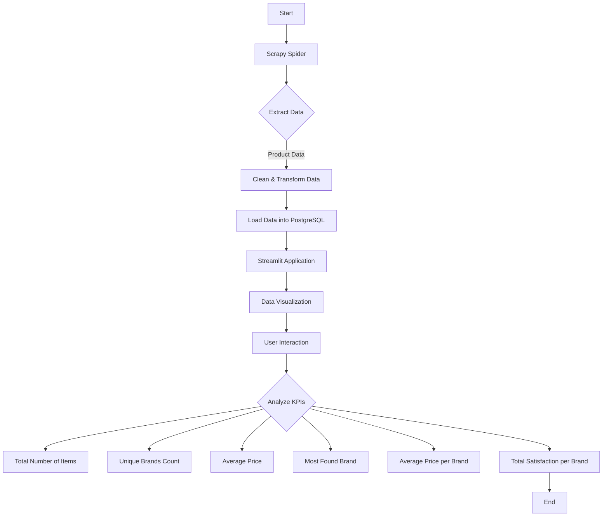

# 📊 Project Overview
In this project, I made an ETL to collect sports shoes and analyzed some points, focusing on men's sports shoes. I also created a dashboard to visualize the data graphically.

# ⚙️ Technologies Used
- **Scrapy**: Powerful web scraping framework for Python.
- **Streamlit**: Rapid web app development framework.
- **PostgreSQL**: Reliable relational database system.
- **Pandas**: Essential data manipulation library for Python.

# 💡 KPIs
1. Number of unique brands
2. Average price
3. Most found brand up to page 10
4. Average price per brand
5. Total satisfaction by Brand

### Insights
*From the analysis, several general insights emerged*:

1. **Number of unique brands**: The number of unique brands is 85
2. **Average price**: The average price of a shoe is 188.19$.
3. **Most found brand up to page 10**: The Most found brand is olympikus
4. **Average price per brand**: The average price per brand varies between 1449$ and 47$.
5. **Total satisfaction by Brand**: Total satisfaction by Brand varies between 5 and 3.8 stars.

